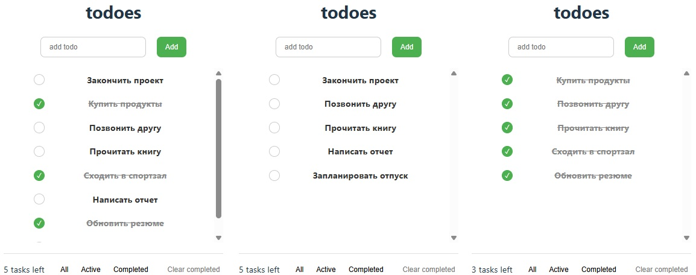

# Проект: "TaskMaster" - Управление задачами с Redux Toolkit

**Frontend-разработчик**

**Цель проекта:**  
Создание продуктивного приложения для управления задачами с возможностью фильтрации, статистикой выполнения и сохранением состояния.

**Используемые стеки:**  
TypeScript, React, Redux Toolkit, Vitest

**В рамках проекта выполнены следующие задачи:**

- Разработал систему добавления/удаления задач с генерацией уникальных ID
- Реализовал переключение статуса выполнения задач
- Создал систему фильтрации (все/активные/выполненные)
- Добавил функцию очистки выполненных задач

**Тестирование:**

- Написал комплекс unit-тестов для редюсеров и селекторов (Vitest)

**Установка и запуск:**
```
npm install
npm run start
npm run test
```

### Демонстрация проекта:



